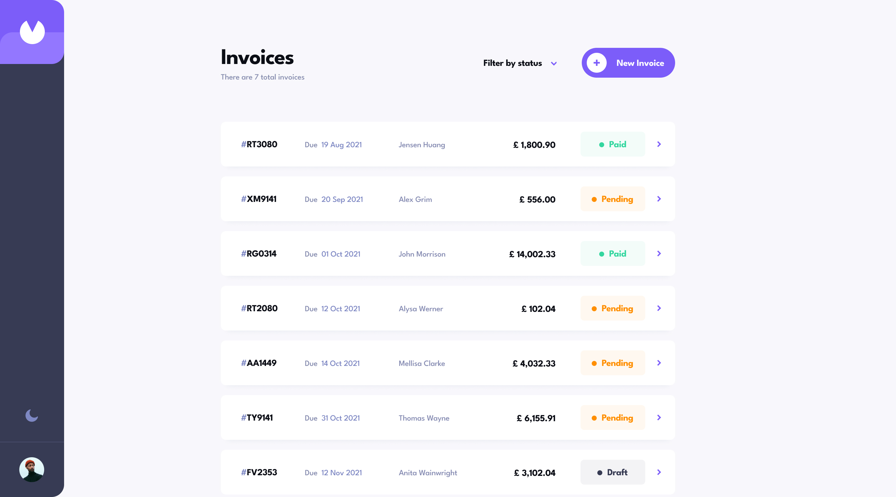
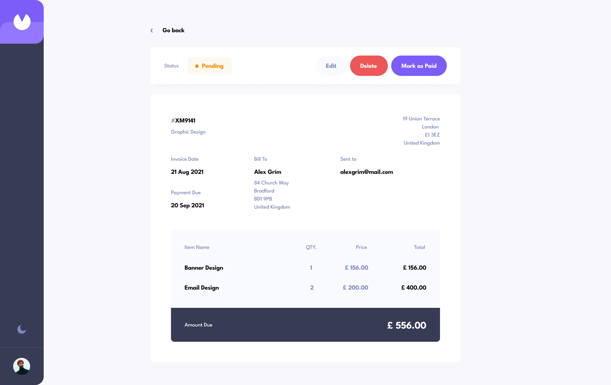
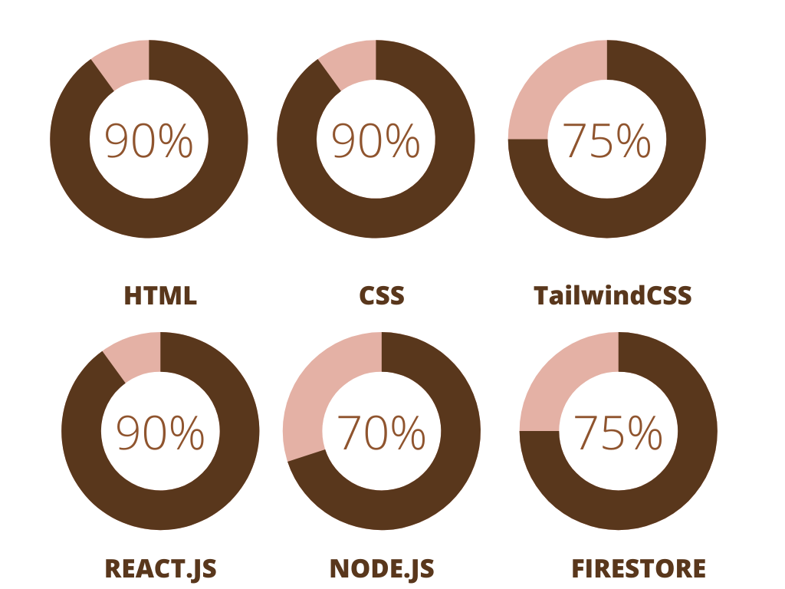

# Invoice app

## Table of contents

- [Overview](#overview)
  - [Built with](#built-with)
  - [Screenshot](#screenshot)
  - [Links](#links)
  - [Author](#author)
  - [Skills](#skills)

## Overview

### About Project

This project took me about 1 week to finish. It's fully backed with a Node.js heroku server and Firebase/Firestore database. I used a Mobile-first workflow because i used tailwind as a CSS framework

### Built with

- Semantic HTML5 markup
- CSS
- Flexbox
- CSS Grid
- Mobile-first workflow
- Webpack
- [React](https://reactjs.org/) - Frontend framework
- [TailwindCSS](https://tailwindcss.com//) - For styles
- [Node.js](https://nodejs.org/) - Backend framework
- [Firebase/Firestore](https://firebase.google.com/) - NoSQL Database

### Screenshot

![Desktop-View Invoice[Dark]](./screenshots/screenshot-1.jpg)
![Desktop-Invoice[Dark]](./screenshots/screenshot-2.jpg)

### Links

- Project Repo URL: [https://github.com/Abrham007/invoice.git](https://github.com/Abrham007/invoice.git)
- Live Site URL: [https://invoice-app-v1-2999941a9473.herokuapp.com/](https://invoice-app-v1-2999941a9473.herokuapp.com/)

### Author

- Website - [Abrham Araya](https://www.your-site.com)
- Github - [Abrham007](https://github.com/Abrham007)
- Stackover-flow - [Abrham Araya](https://stackoverflow.com/users/22762463/abrham-araya)

### Skills

